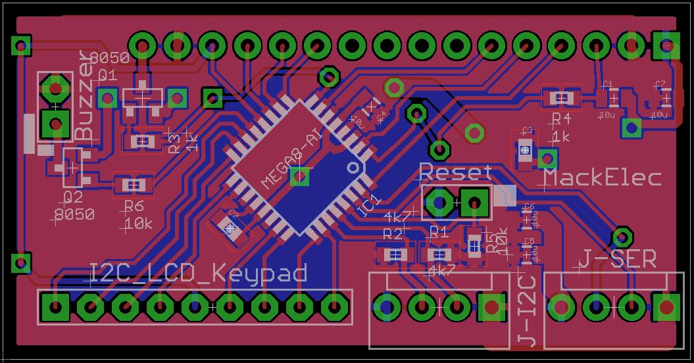

# arduLCDkeypad

- Designed to reduce the workload and pin count to incorporate a LCD and keypad.  Pease copy and improve this project in any way you wish.

## Hardware
- ATmega328 based LCD piggy back board with 5x4 Keypad port.
- ATmega328 using internal 8Mhz clock.
- uses MCUdude Minicore bootloader.
- Arduino source code.
- Piggyback for standard LCD up to 20x4 LCD.
- Serial and I2c interface.
- Variable contrast control.
- Variable Backlight control.
- Piezo, click on key press.

## Firmware
- Commands from either 9600 serial or I2c (add 42).
- Basic LCD fuctions like Clear, Cursor, Print, Print at,
### Extra features
- Predefine a field (template) with a format string.  Just update a variable value and it will format and print it at the right location.
- Predefined Time formats.  ("HH:mm:ss") or ("YYYY-MM-dd HH:mm:ss") Using the long value (time_t ) as the variable type.
- Auto time mode: using Time library, update the LCD every second 

## Library
- Simple interfacing to arduLCDkeypad.

