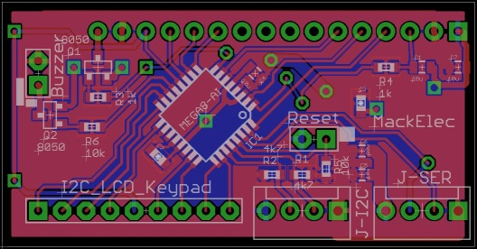

# arduLCDkeypad

- Designed to reduce the workload and pin count required to incorporate a LCD and keypad.  Pease copy and improve this project in any way you wish.

## Hardware
- ATmega328 based LCD piggy back board with 5x4 Keypad port.
- ATmega328 using internal 8Mhz clock.
- uses MCUdude Minicore bootloader.
- Arduino source code.
- Piggyback for standard LCD up to 20x4 LCD.
- Serial and I2c interface.
- Variable contrast control.
- Variable Backlight control.
- Piezo, click sound on key press.

## Firmware
- Communicate Commands by either 9600 serial or I2c (address 42).
- Basic LCD fuctions like Clear, Cursor, Print, Print at,
### Extra features
- Predefine a field (template) with a format string (as in C printf format).  Just update a variable value and it will format and print it at the right location.
- Handles Float Formats (basic).  eg., "%03.5f"
- Predefined Time formats.  ("HH:mm:ss") or ("YYYY-MM-dd HH:mm:ss") Using the long value (time_t ) as the variable type.
- Auto time mode: using Time library to maintain a real time clock; if used it will autonomously refresh the time field every second.
- Dual settings for backlight level.  Keypress activates higher backlight level and times out to lower level.

## Library
- Simple interfacing to arduLCDkeypad.

### Commands

- arduLCDkeypad(Serial) 
- arduLCDkeypad(Wire,42)
Instantiation of arduLCDkeypad object.  If Wire, second parameter defines I2C address.

- Clear() 
Clears LCD
- setCursor(col,row)
- printAt(char message[],col,row,blank)  
Prints a char string at col,row. Blank is optional; Blank will print number (blank value) of spaces at col,row before printing string.
- Contrast( int percent) 
Sets the contrast level (0 - 100 default is 5).
- BackLight(int percentStandby, int percentActive)  
Set the Backlight brightness.  When key is pressed it goes to Active level, when BackLight Timer times out it goes back to standby level.
- BackLightTimer(int backlightTimeout)
Sets the backlightTimer (seconds)
- Buzz(int BuzzLen)
Turns buzzer on for buzzLen milliseconds (one shot)
- char keyPressed()
Returns a char value of a keypress.  A value of NO_KEY indicates no key was pressed
- bool recReset()
returns True if arduLCDkeyboard has been RESET. Must be called after calling keyPressed().
- bool present()
returns true if arduLCDkeyboard is responding.  Must be called after calling keyPressed().
- updateLcdField(id,col,row,len,visible,strFormat)
LCD fields are available to preset a field, which has its position and format string (C standard) stored, then only needing the value for that field to be updated as required.  That value will be displayed using the format string.
- updateLcdFieldFormat(id,char strFormat)
Updates the Format stored for the field.  This function is useful because the standard WIRE library only has a buffer of 34 and a long format string can cause the updateLcdField command to exceed the buffer size.
- updateTime(unsigned long notTime)
ArduLCDkeyboard uses Time library to keep real time.  Use time_t (which is unsigned long) to update to current time.
- setAutoTime(fieldId)
This allows arduLCDkeypad to maintain the LCD field automatically (on a second basis).  You need to prime the LCD field with a suitable format string ie, "HH:mm:ss" or "YYYY-MM-dd HH:mm:ss". Negative Id will turn it off.

